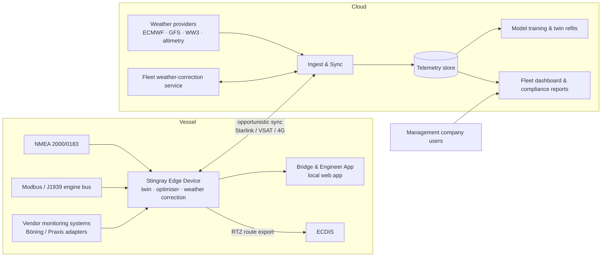

# Stingray — Technical Architecture

**Version 0.1 · July 2026**
Follows PRODUCT_SPEC.md and the Section 11 decisions: hybrid hardware, NMEA + manual-fuel sensor floor, advisory-only, edge-first.

---

## 1. Architecture principles

1. **Edge-first.** All safety-of-navigation-adjacent function (planning, re-optimisation, twin inference) runs onboard with zero cloud dependency. Cloud adds fleet learning, reporting, and model training — it is never in the critical path.
2. **Advisory-only.** No control outputs to any vessel system. Read-only bus connections, galvanically isolated. This keeps class/flag scope minimal by design.
3. **Degrade gracefully.** Every capability has a defined behaviour at each sensor tier (full integration → NMEA + manual fuel).
4. **Privacy by architecture.** Per-vessel data isolation; fleet learning uses only anonymised, aggregated derivatives.

## 2. System overview

## 3. Edge device

**Hardware (own-brand unit):**

- Marine-grade fanless ARM SBC (e.g. i.MX8/Jetson-class), −25…+70°C, IEC 60945 EMC design target.
- Interfaces: 2× NMEA 2000 (CAN, isolated), NMEA 0183 serial, 2× RS-485 (Modbus RTU), Ethernet (Modbus TCP / vendor systems / ship LAN), USB expansion.
- Integrated 9-axis MEMS IMU (trivial BOM cost; the comfort/sea-state ground truth) + GNSS fallback. Ship's NMEA attitude (PGN 127257) is used as a cross-check where present, but is angles-only, often low-rate/damped, and lacks the linear accelerations needed for ISO 2631 dosing and wave-spectrum estimation — hence the onboard unit.
- Connectivity: ship LAN (Starlink/VSAT) primary, LTE fallback; all sync opportunistic store-and-forward.
- Local storage ≥512GB (months of full-rate telemetry).

**Software stack:**

- Linux + container runtime; A/B partition OTA updates with rollback; remote fleet device management (e.g. Mender-class).
- Services: bus ingestion & signal normalisation → local time-series store → twin inference → optimiser → local web server (bridge app) → sync agent.
- Language choices: data plane and services in **Rust or Go** (reliability, low footprint); models in **Python/ONNX** — train anywhere, run as ONNX on device; UI **TypeScript/React**, served locally, tablet-first.

**Vendor-integration path (hybrid decision):** adapter layer with per-vendor plugins (Böning AHD, Praxis Mega-Guard, CBM/Krill, KPM). Where a monitoring system already aggregates engine data, Stingray connects to it (Modbus TCP/OPC UA export) instead of duplicating wiring. Same normalised signal model downstream either way.

**Fuel signal hierarchy** (in preference order; the twin fuses whatever is present):

1. **Engine-reported fuel rate** — PGN 127489 (NMEA 2000) / SPN 183 (J1939); present on most modern electronic engines (MAN, MTU, CAT). ~2–5% absolute accuracy but consistent — ideal for optimisation, and free on the bus.
2. **Tank levels** — PGN 127505; poor instantaneous signal (sender resolution, sloshing, tank geometry, day-tank transfers) but good for slow reconciliation: per-passage/daily totals, attitude-corrected via the IMU, with transfer-event detection.
3. **Manual daily entries** — 30-second bridge-app flow; fallback for older mechanical engines. Treated as low-frequency, high-uncertainty observations — same pipeline, wider confidence bands.
4. **Dedicated flowmeters** — optional upgrade for verification-grade savings metering only; never required for the product to function.

## 4. Digital twin

Physics-informed, per-vessel, learned online. Not a black box — each component is interpretable and separately calibrated:

| Component | Model | Cold start | Learned from |
|---|---|---|---|
| Calm-water resistance/power | Parametric hull model + fitted sea-trial curve | Builder data, sea trials, sister-ship priors | Shaft power/fuel vs STW |
| Added resistance in waves | Semi-empirical (e.g. STAWAVE-class) conditioned on wave spectrum | Hull particulars | Observed speed loss vs sea state |
| Propulsion & SFOC | Per-engine fuel map (RPM × load), gen-set curves | Engine maker data | Fuel flow / manual fuel |
| Motion response | RAO-approximation per heading/period + learned correction | Hull form estimate | Onboard IMU |
| Degradation (fouling, drift) | Slow-varying bias states | zero | Residual trend over weeks |

- Estimation core: **Bayesian state estimation** (Kalman-family for bias states, Gaussian-process or gradient-boosted residual models for nonlinear corrections). Every prediction carries a confidence interval, surfaced in the UI.
- Twin outputs: fuel rate, ETA, motion/comfort indices (ISO 2631 dose), wear proxies (engine load cycling, time-at-poor-SFOC, slamming counts) for any candidate (route, speed, config, weather) tuple.
- Retraining: onboard incremental updates continuously; full refits in cloud when connected; models versioned, signed, shipped via OTA.

## 5. Optimisation engine

- **Search space:** time-expanded graph over a corridor around the great-circle/rhumb route (adaptive grid, ~2–10nm spacing), × speed profile × engine/generator configuration.
- **Method:** dynamic programming / A* over the time-expanded graph (the industry-proven approach) with the twin as the cost oracle. Config choice (e.g. 1 vs 2 engines, gen scheduling) folded in as discrete state per edge.
- **Objectives:** weighted scalarisation of fuel, time, comfort (motion dose), wear proxies — weights set by the mission slider/preset. Also produces 2–3 Pareto-distinct candidate plans, not one answer.
- **Constraints:** hard ETA windows, weather/motion limits, no-go areas (draft, TSS, ECAs, owner-defined), minimum speeds.
- **Runtime budget:** full passage plan <60s on edge hardware; incremental re-optimisation <10s, triggered by weather-correction or performance drift beyond thresholds.

## 6. Weather and sea state pipeline

- **Ingest:** ECMWF/GFS atmospheric + WW3/ECMWF wave GRIBs (swell/wind-sea partitioned), delta-compressed and cropped to route corridor for bandwidth-constrained vessels.
- **Local correction:** onboard observations (anemometer, baro, measured current set/drift from STW–SOG, IMU-derived wave spectrum) assimilated via lightweight bias-correction (Kalman filter on forecast error fields, decaying with distance/lead time).
- **Fleet correction network:** anonymised observation/error tuples sync to cloud; a fleet-wide correction field is redistributed to nearby vessels. Cold-start value from day one (public obs), compounding with fleet size.
- **Sea state ground truth:** the edge IMU doubles as a wave buoy (response-based spectrum estimation using the motion model) — closes the loop on both forecast correction and motion-model learning.

## 7. Cloud platform

- **Sync:** per-vessel message queue, store-and-forward both directions; conflict-free (vessel is source of truth for telemetry, cloud for fleet config/models).
- **Storage:** time-series store (e.g. TimescaleDB) for telemetry; object store for raw logs, GRIBs, model artefacts. Strict per-vessel tenancy; fleet aggregates computed in an isolated anonymisation pipeline.
- **Services:** fleet dashboard (web), compliance report generator (SEEMP-support, voyage debriefs, CO₂ baselines vs actuals; SEA Index/YETI export), model training, device fleet management, weather-correction service.
- **Deployment:** single cloud provider, IaC from day one; modest scale (500 vessels ≈ small data platform — do not over-engineer).

## 8. Security & privacy

- Device: signed boot + signed OTA; no inbound connections (device dials out only); mTLS to cloud.
- Position data is owner-sensitive: encrypted at rest per vessel, access-controlled per management company role, no third-party sharing, delayed/blurred aggregation for fleet learning. Contractual + technical guarantees — a differentiator in this market.
- Bridge app on ship LAN only; no internet exposure of the edge device.

## 9. Sensor-tier behaviour matrix

| Capability | Full integration | NMEA + engine fuel rate (typical modern yacht) | NMEA-only + manual fuel |
|---|---|---|---|
| Passage planning | Full | Full | Full (wider fuel confidence) |
| Live re-optimisation | Full | Full | Route/speed only |
| Engine-config advice | Yes | Yes (per-engine rates on bus) | Generic (from spec/priors) |
| Wear proxies | Measured | Partially measured | Estimated only |
| Comfort/sea state | Full (IMU always present) | Full | Full |
| Savings verification | Metered | Engine-reported + tank-reconciled | Modelled + tank-reconciled |

Note: engine-reported fuel rate (PGN 127489/SPN 183) means most vessels with modern electronic engines land in the middle tier with no extra hardware — the manual-fuel floor applies mainly to older mechanical installations.

## 10. Build plan

| Phase | Scope | Duration |
|---|---|---|
| 0 — Bench | Signal pipeline + twin v0 on recorded/synthetic data; optimiser prototype vs published benchmarks | 2–3 months |
| 1 — Pilot vessel | Edge device rev A on 1–2 friendly yachts; passage planner + debrief; manual fuel tier proven | 4–6 months |
| 2 — Product | Vendor adapters (top 2), fleet dashboard, compliance reports, OTA fleet management; 10-vessel pilot fleet | 6 months |
| 3 — Scale | Weather-correction network live, hardware rev B (EMC certified), management-company onboarding | ongoing |

Team to Phase 2: ~6 engineers (2 edge/embedded, 2 modelling/optimisation, 1 full-stack, 1 cloud/devops) + naval-architecture consultancy for twin priors.

## 11. Key technical risks

1. **Twin accuracy at the manual-fuel tier** — mitigate: pilot-vessel validation before committing to the tier publicly; conservative confidence display.
2. **Bus-data variability across yachts** (non-standard installs, missing PGNs) — mitigate: adapter layer + install-survey checklist; budget per-vessel commissioning time honestly.
3. **Optimiser trust on the bridge** — mitigate: always show reasoning + confidence; never auto-apply; capture captain overrides as training signal.
4. **Weather-correction value below expectation** — mitigate: it's additive, not foundational; product works on raw GRIBs.
